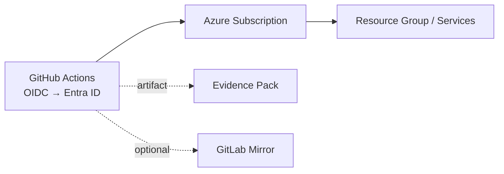

# Fedlin – Azure Secure CI/CD

A lean GitHub Actions pipeline for deploying to Azure with short-lived, federated auth. Optional GitLab mirroring. Each run publishes a small Evidence Pack for traceability.

[](https://github.com/fedlinllc/fedlin-azure-secure-cicd/actions/workflows/evidence-pack.yml)
-blue)


---

## Overview
- **Authentication:** GitHub Actions → Microsoft Entra via OIDC (no long-lived cloud secrets).
- **Operations:** Idempotent deploy tasks using Az CLI / Terraform.
- **Mirroring (optional):** One-way push to GitLab using a token stored in GitHub Secrets.
- **Evidence:** Each run uploads a small artifact with run metadata and a file manifest.

---

## Quickstart
```bash
# Trigger Evidence Pack (manual workflow)
gh workflow run evidence-pack.yml -R fedlinllc/fedlin-azure-secure-cicd

# Download the latest artifact
RID=$(gh run list --workflow "evidence-pack.yml" -R fedlinllc/fedlin-azure-secure-cicd -L 1 --json databaseId -q '.[0].databaseId')
gh run download "$RID" -R fedlinllc/fedlin-azure-secure-cicd -D "/tmp/evidence/$RID"
```

---

## Evidence Pack
| File | Notes |
|---|---|
| `metrics.json` | Run metadata (`repo`, `sha`, `run_id`, `pipeline_status`, `idempotent`). |
| `manifest.md` | Human-readable list of files emitted in the run. |
| `rbac_report.json` *(optional)* | Role assignments snapshot when Azure vars are present. |

> Actions → **Evidence Pack** → **Run workflow** to generate a fresh artifact.

---

## Diagram


---

## Usage notes
- **GitLab mirror (optional):**
  - Set `GITLAB_TOKEN` (project access token with `write_repository`) and `GITLAB_MIRROR_URL`.
- **Azure optional evidence:**
  - Set `AZURE_FED_CLIENT_ID`, `AZURE_TENANT_ID`, `AZURE_SUBSCRIPTION_ID` to enable `rbac_report.json`.

---

## Security
- Federated auth (OIDC) from GitHub to Azure; no PATs or cloud creds committed.
- Repository protections enabled (reviews on `main`, secret scanning/push protection).
- Generated outputs and local artifacts are ignored by default.

---

## Screenshots
- `docs/img/01-workflow-run.png` – Actions run summary  
- `docs/img/02-artifact-manifest.png` – Evidence artifact contents  
- `docs/img/03-branch-protection.png` – Branch protection view
