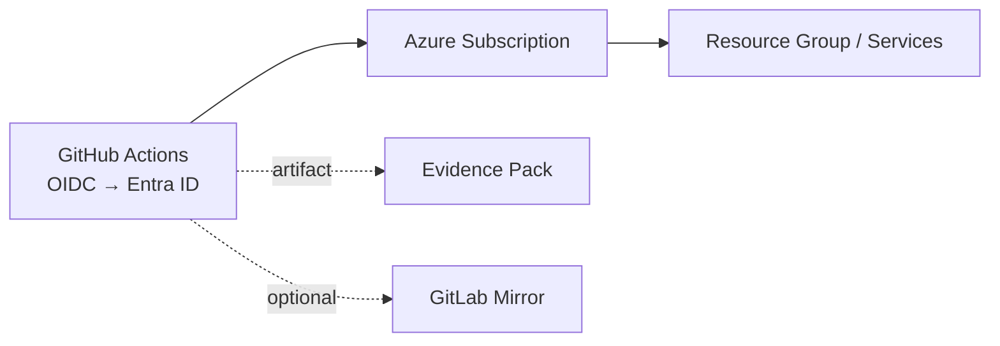

# Fedlin – Azure Secure CI/CD

A lean GitHub Actions pipeline for deploying to Azure with short-lived, federated auth. Optional GitLab mirroring. Each run publishes a small Evidence Pack for traceability.

[](https://github.com/fedlinllc/fedlin-azure-secure-cicd/actions/workflows/evidence-pack.yml)
-blue)


---

## Overview
- **Authentication:** GitHub Actions → Microsoft Entra via OIDC (no long-lived cloud secrets).
- **Operations:** Idempotent deploy tasks using Az CLI / Terraform.
- **Mirroring (optional):** One-way push to GitLab using a token stored in GitHub Secrets.
- **Evidence:** Each run uploads a small artifact with run metadata and a file manifest.

---

## Quickstart
```bash
# Trigger Evidence Pack (manual workflow)
gh workflow run evidence-pack.yml -R fedlinllc/fedlin-azure-secure-cicd

# Download the latest artifact
RID=$(gh run list --workflow "evidence-pack.yml" -R fedlinllc/fedlin-azure-secure-cicd -L 1 --json databaseId -q '.[0].databaseId')
gh run download "$RID" -R fedlinllc/fedlin-azure-secure-cicd -D "/tmp/evidence/$RID"
```
> Artifact includes `metrics.json` and `manifest.md`. If Azure variables are set, `rbac_report.json` may be present.

---

## Evidence Pack
| File | Notes |
|---|---|
| `metrics.json` | Run metadata (`repo`, `sha`, `run_id`, `pipeline_status`, `idempotent`). |
| `manifest.md` | Human-readable list of files emitted in the run. |
| `rbac_report.json` *(optional)* | Role assignments snapshot when Azure vars are present. |

---

## Manual setup notes
- **Repository**
  - Visibility: **Public**
  - Branch protection on `main`: admins enforced; ≥1 approval; status checks strict (no named checks required)
  - Code security and analysis: **Secret scanning** + **Push protection** enabled
- **Secrets & tokens**
  - `GITLAB_TOKEN` stored in **GitHub Secrets** (project access token with `write_repository`)
  - Optional mirror: set `GITLAB_MIRROR_URL`
- **Auth to Azure (optional)**
  - Actions use **OIDC** to Microsoft Entra (no long-lived cloud secrets)
  - To enable extra evidence: set `AZURE_FED_CLIENT_ID`, `AZURE_TENANT_ID`, `AZURE_SUBSCRIPTION_ID`
- **Hygiene & history**
  - Generated outputs are **.gitignored** (e.g., `evidence/`, `outputs/` in other repos)
  - Past sensitive files were **removed from history**; force-push was temporarily enabled then disabled

---

## Diagram


---

## Usage notes
- **GitLab mirror (optional):** set `GITLAB_TOKEN` + `GITLAB_MIRROR_URL`
- **Azure optional evidence:** set `AZURE_FED_CLIENT_ID`, `AZURE_TENANT_ID`, `AZURE_SUBSCRIPTION_ID`

---

## Screenshots
Paste your screenshots at the indicated placeholders and add the images to `docs/img/`:

1. **Actions run summary** — *placeholder below*
   - Path: `docs/img/01-workflow-run.png`
   - Caption suggestion: `Evidence Pack run • run_id=<RID> • <YYYY-MM-DD>`
   - **PLACEHOLDER:** *(paste image here in GitHub UI)*

2. **Evidence artifact contents (manifest/metrics)** — *placeholder below*
   - Path: `docs/img/02-artifact-manifest.png`
   - Show `pipeline_status=success` and `idempotent=true`
   - **PLACEHOLDER:** *(paste image here in GitHub UI)*

3. **Branch protection settings** — *placeholder below*
   - Path: `docs/img/03-branch-protection.png`
   - Show: admins enforced; 1 approval; strict checks
   - **PLACEHOLDER:** *(paste image here in GitHub UI)*

4. *(Optional)* **Security & analysis page**
   - Path: `docs/img/04-security-analysis.png`
   - Show Secret scanning + Push protection enabled
   - **PLACEHOLDER:** *(paste image here in GitHub UI)*

5. *(Optional)* **Entra federated credential** (if configured)
   - Path: `docs/img/06-entra-federated-credential.png`
   - Show subject/issuer tied to repo/branch
   - **PLACEHOLDER:** *(paste image here in GitHub UI)*

---

## Security
- Federated auth (OIDC) from GitHub to Azure; no PATs or cloud creds committed.
- Repository protections enabled (reviews on `main`, secret scanning/push protection).
- Generated outputs and local artifacts are ignored by default.
