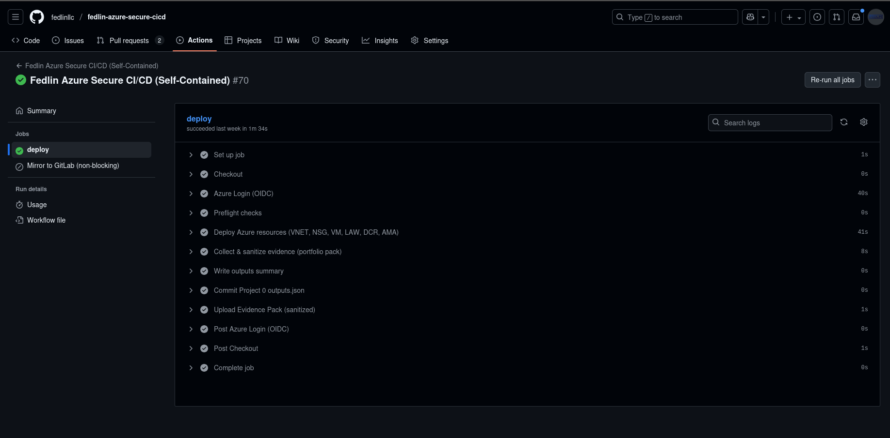

# Project 0 – Azure Secure CI/CD Baseline

**Repo:** `fedlin-azure-secure-cicd` • **Branch strategy:** protected `main`, squash merges  
**Auth:** GitHub OIDC → Azure (no long-lived client secrets)

> #### Preconfigured (one-time manual)
> - Protect `main` (PRs + squash merges).
> - Entra ID **federated credential** for this repo/workflow; **RG-scoped RBAC** only.
> - GitHub repo **secrets** for Azure OIDC where applicable (no secrets in code).
> - Evidence screenshots stored under `docs/img/`.

---

## Summary

Passwordless, least-privileged deployment path to Azure using **GitHub OIDC** and a minimal, idempotent pipeline that exports outputs for downstream labs (Sentinel, Hardening/OpenSCAP, Purview DLP). The pipeline run below demonstrates the baseline working end-to-end:



---

## Architecture at a Glance

This repo provisions a shared baseline Resource Group and telemetry primitives consumed by later projects.

```
GitHub Actions (OIDC federated)
│
▼
Azure Resource Group: fedlin-rg
├─ Log Analytics Workspace:  fedlin-law
├─ Data Collection Rule:     fedlin-dcr
└─ Data Collection Endpoint: fedlin-evidence-dce
    ├─ Project 1: Sentinel Vulnerability & Compliance Lab
    ├─ Project 2: Hardening & Remediation (Ansible/OpenSCAP)
    └─ Project 3: Purview DLP Lab
```

RG state after a successful deployment:


Azure’s native deployment history provides immutable confirmation of outcomes:


---

## Secure Pipeline Highlights

**OIDC to Azure.** Short-lived tokens via a federated credential—no client secrets committed or stored.  


**Least privilege.** RBAC is limited to the Resource Group used by this baseline.  


**Deterministic & idempotent.** Safe to re-run; stable names; predictable outputs.

**Protected flow.** Work lands via PRs and squash merges to keep history linear.

**Evidence-first.** Artifacts and screenshots demonstrate control intent → outcome.  


*(Optional) If GitLab mirroring is enabled, capture a Branches view to show recent push provenance.*  


---

## Run It

**GitHub UI:** Actions → run the deploy workflow on `main` (or a PR branch).

**CLI:**
```bash
gh workflow run deploy-azure.yml --ref main
gh run watch --exit-status
```

**Expected results**
- Workflow completes without secrets in logs.
- Azure **Deployments** blade shows **Succeeded** for this run (see screenshot above).
- Downstream projects can consume this repo’s `outputs.json` as needed.

---

## Clean Up

- Remove temporary branches after merge:
```bash
git push origin :<branch-name>
```
- Resource teardown is handled in downstream labs when appropriate; this baseline is intended to persist for reuse.

---

## Appendix — One-time manual configuration performed

- **GitHub**
  - Protected `main` (PRs required; squash merges enabled).
  - Added necessary secrets only for Azure OIDC usage (kept out of code).

- **Azure / Entra**
  - Created a **federated credential** tied to this repo/workflow.
  - Applied **RG-scoped** role assignments to enforce least privilege.

**Notes**
- No subscription IDs, tenant IDs, or tokens are exposed in docs or logs.
- All images are under `docs/img/` for portability across clones/forks.
- This baseline is the prerequisite for Projects 1–3 (SIEM, hardening, DLP).
